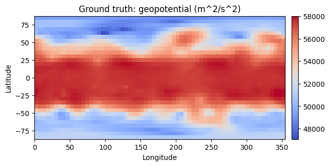
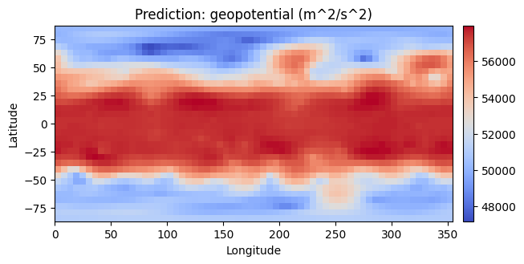
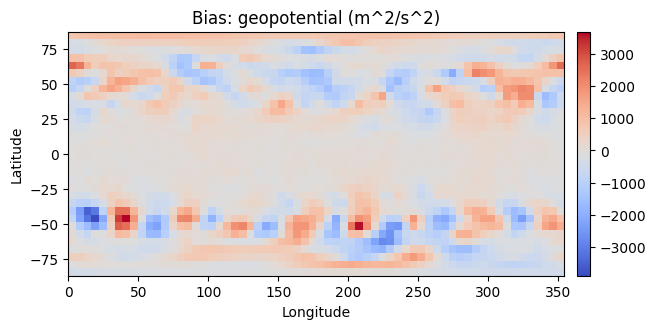
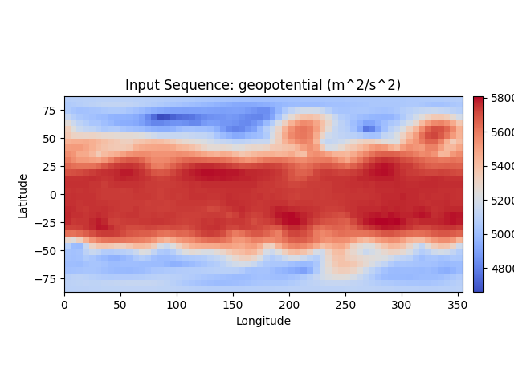
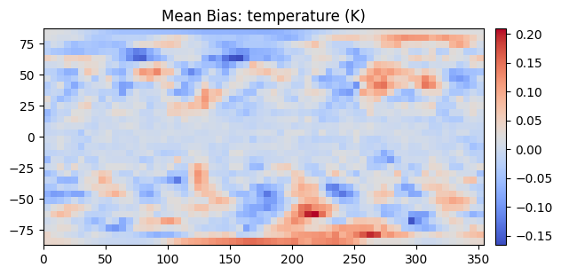

Visualizations
==============

Visualizing a Specific Prediction
^^^^^^^^^^^^^^^^^^^^^^^^^^^^^^^^^

For a specific prediction, ClimateLearn can show the bias, defined as the
predicted value minus the observed value at each grid cell. This is useful
for intuitively understanding which direction the model is erring in.

.. code-block:: python

    import climate_learn as cl

    # assuming we are forecasting geopotential from ERA5
    dm = cl.IterDataModule(...)
    model = cl.load_forecasting_module(...)
    denorm = model.test_target_transforms[0]

    cl.utils.visualize(
        model,
        dm,
        in_transform=denorm,
        out_transform=denorm,
        variable="geopotential",
        src="era5",
        index=0  # visualize the first sample of the test set
    )

In the case that history is greater than 1 (*i.e.*, the model is given a
sequence of historical weather states as input), ``cl.utils.visualize``
returns an object which can be animated. See the
`quickstart notebook <https://colab.research.google.com/drive/1LcecQLgLtwaHOwbvJAxw9UjCxfM0RMrX?usp=sharing>`_
for an interactive example of this.

.. code-block:: python

    from IPython.display import HTML
    in_graphic = cl.utils.visualize(...)
    HTML(in_graphic.to_jshtml())

Visualizing Average Performance
^^^^^^^^^^^^^^^^^^^^^^^^^^^^^^^

ClimateLearn can also display the mean bias, which is the average bias across
the entire testing set. This is helpful for understanding trends in the model's
predictions.

.. code-block:: python

    import climate_learn as cl

    # assuming we are forecasting geopotential from ERA5
    dm = cl.IterDataModule(...)
    model = cl.load_forecasting_module(...)
    denorm = model.test_target_transforms[0]

    cl.utils.visualize_mean_bias(
        dm,
        model,
        out_transform=denorm,
        variable="geopotential",
        src="era5"
    )

